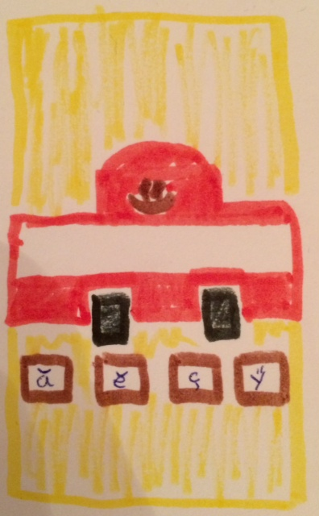

# Chuvash keyboard layout for web

Urapa ([/uraba/](http://en.wikipedia.org/wiki/Chuvash_language)) is a light-weight javascript library for writing Chuvash in mobiles and beyond. 

This is a little mockup of the Urapa web application:



### Building and developing

To build the project you must have nodejs, grunt, and npm.

```
npm install
grunt build
```


### Hosting

The web apps is hosted on [Github Pages](https://help.github.com/articles/what-are-github-pages)

### Deploying

The web app is deployed with the git command [subtree](https://gist.github.com/cobyism/4730490).
```sh
git checkout gh-pages
git merge master
#git subtree push --prefix dist origin gh-pages
```

Before you do it for the first time, make sure you don't have a branch gh-pages.